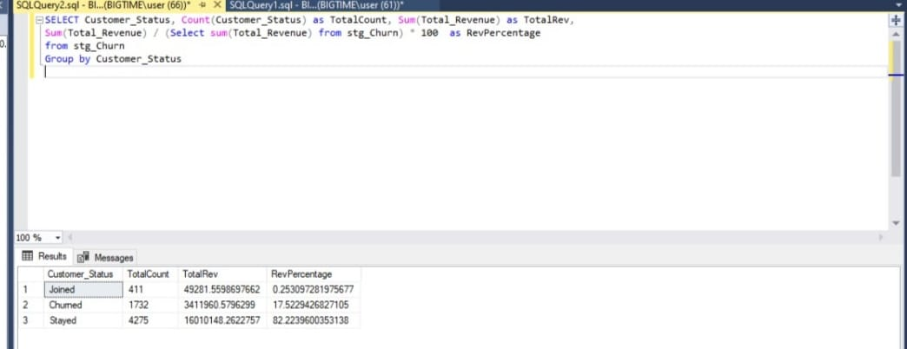

# Data Portfolio: Telecom Customer Churn Analysis


# Table of Contents

- [Objective](#objective)
- [Data Source](#data-source)
- [Stages](#stages)
- [Design](#design)
  - [Mockup](#mockup)
  - [Tools](#tools)
- [Development](#development)
  - [Pseudocode](#pseudocode)
  - [Data Exploration](#data-exploration)
  - [Data Cleaning](#data-cleaning)
  - [Transform the Data](#transform-the-data)
  - [Create the SQL View](#create-the-sql-view)
- [Testing](#testing)
  - [Data Quality Tests](#data-quality-tests)
- [Visualization](#visualization)
  - [Results](#results)
  - [DAX Measures](#dax-measures)
- [Analysis](#analysis)
  - [Findings](#findings)
  - [Validation](#validation)
  - [Discovery](#discovery)
- [Recommendations](#recommendations)
  - [Potential ROI](#potential-roi)
  - [Potential Courses of Actions](#potential-courses-of-actions)
- [Conclusion](#conclusion)

# Objective

- **What is the key pain point?**

The Head of Customer Retention and the Marketing Team lack a centralized solution to understand why telecom customers are churning, identify at-risk segments, and predict future churners. Manual analysis and fragmented data sources hinder effective retention strategies.

- **What is the ideal solution?**

To create an end-to-end solution that:
- Implements an ETL pipeline to process customer data.
- Analyzes churn patterns across demographics, geography, account info, and services.
- Predicts future churners using a Random Forest machine learning model.
- Visualizes insights in a Power BI dashboard, showing:
  - Total Customers, Total Churn, Churn Rate, New Joiners.
  - Churn by contract type, payment method, service type, and region.

This will empower the team to design targeted retention campaigns and reduce churn effectively.

## User Story

As the Head of Customer Retention, I want to use a Power BI dashboard that analyzes telecom customer data and predicts churn using machine learning, so that I can identify at-risk segments, understand churn drivers, and implement proactive retention strategies to maximize ROI.

# Data Source

- **What data is needed to achieve our objective?**

We need telecom customer data including:
- Customer ID, Gender, Age, Region (State), Tenure.
- Contract Type, Monthly Charges, Payment Method.
- Services subscribed (Phone, Internet, Streaming, etc.).
- Customer Status (Churned, Stayed, Joined).

- **Where is the data coming from?**

The data is sourced from an internal staging table (`stg_Churn`) in the company’s SQL Server database (`db_Churn`). This table contains historical customer data used for analysis and prediction.

# Stages

- Design
- Development
- Testing
- Visualization
- Analysis

# Design

## Dashboard Components Required

To meet the requirements, the dashboard must answer:
1. What are the Total Customers, Total Churn, Churn Rate, and New Joiners?
2. How does churn vary by Gender, State, Contract Type, and Services?
3. Which customers are predicted to churn, and what are their profiles?
4. What are the key risk factors for churn (e.g., tenure, contract types)?

Appropriate visuals include:
- Scorecards (for metrics like Total Customers, Churn Rate).
- Bar charts (for churn by Gender, State, Contract).
- Tables (for predicted churners).
- Filters (for interactive segmentation).

## Dashboard Mockup


## Tools

| Tool           | Purpose                                  |
|----------------|------------------------------------------|
| SQL Server     | ETL pipeline, data cleaning, and views   |
| Python         | Random Forest model for churn prediction |
| Power BI       | Visualizing data via interactive dashboards |
| GitHub         | Hosting project documentation and code   |
| Mokkup AI      | Designing dashboard wireframes/mockups   |

# Development

## Pseudocode

1. Extract raw data from the `stg_Churn` table in SQL Server.
2. Explore the data to identify patterns and issues (e.g., nulls, distributions).
3. Clean and transform the data (handle nulls, standardize formats).
4. Load the cleaned data into a production table (`prod_Churn`).
5. Create SQL views for Power BI (`vw_ChurnData`, `vw_JoinData`).
6. Develop a Random Forest model to predict churn.
7. Visualize insights in Power BI.
8. Document the process and publish to GitHub.

## Data Exploration Notes

- **Initial Observations**:
  1. The dataset contains all required fields (Customer ID, Gender, State, Contract, Services, etc.).
  2. Some columns (e.g., Internet Type, Value Deal) have null values that need handling.
  3. Customer Status includes "Churned," "Stayed," and "Joined," aligning with metrics needs.
  4. Tenure and Monthly Charges show variability, which may correlate with churn.

### SQL Query - Check Distinct Values

#### Gender Distribution
```sql
SELECT Gender, Count(Gender) as TotalCount,
Count(Gender) * 1.0 / (Select Count(*) from stg_Churn) as Percentage
FROM stg_Churn
GROUP BY Gender
```
#### Output 


#### Contract Distribution
```sql
SELECT Contract, Count(Contract) as TotalCount,
Count(Contract) * 1.0 / (Select Count(*) from stg_Churn) as Percentage
FROM stg_Churn
GROUP BY Contract
```
#### Output


#### Customer Status
```sql
SELECT Customer_Status, Count(Customer_Status) as TotalCount, Sum(Total_Revenue) as TotalRev,
Sum(Total_Revenue) / (Select sum(Total_Revenue) from stg_Churn) * 100 as RevPercentage
FROM stg_Churn
GROUP BY Customer_Status
```
#### Output


#### State Distribution
```sql
SELECT State, Count(State) as TotalCount,
Count(State) * 1.0 / (Select Count(*) from stg_Churn) as Percentage
FROM stg_Churn
GROUP BY State
ORDER BY Percentage DESC
```
#### Output


