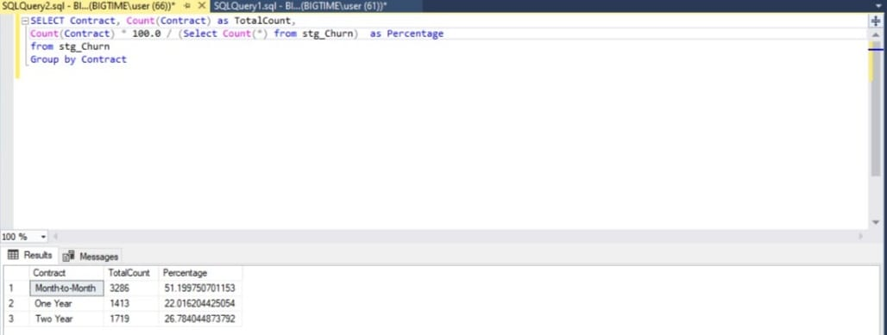
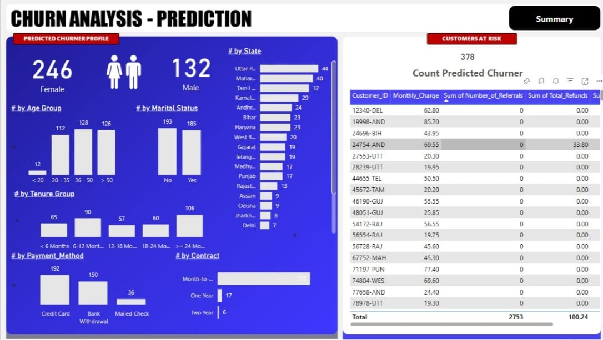

# Data Portfolio: Telecom Customer Churn Analysis


# Table of Contents

- [Objective](#objective)
- [Data Source](#data-source)
- [Stages](#stages)
- [Design](#design)
  - [Mockup](#mockup)
  - [Tools](#tools)
- [Development](#development)
  - [Pseudocode](#pseudocode)
  - [Data Exploration](#data-exploration)
  - [Data Cleaning](#data-cleaning)
  - [Transform the Data](#transform-the-data)
  - [Create the Power BI View](#create-the-powerbi-view)
- [Testing](#testing)
  - [Data Quality Tests](#data-quality-tests)
- [Visualization](#visualization)
  - [Results](#results)
  - [DAX Measures](#dax-measures)
- [Analysis](#analysis)
  - [Findings](#findings)
  - [Validation](#validation)
  - [Discovery](#discovery)
- [Recommendations](#recommendations)
  - [Potential ROI](#potential-roi)
  - [Potential Courses of Actions](#potential-courses-of-actions)
- [Conclusion](#conclusion)

# Objective

- **What is the key pain point?**

The Head of Customer Retention and the Marketing Team lack a centralized solution to understand why telecom customers are churning, identify at-risk segments, and predict future churners. Manual analysis and fragmented data sources hinder effective retention strategies.

- **What is the ideal solution?**

To create an end-to-end solution that:
- Implements an ETL pipeline to process customer data.
- Analyzes churn patterns across demographics, geography, account info, and services.
- Predicts future churners using a Random Forest machine learning model.
- Visualizes insights in a Power BI dashboard, showing:
  - Total Customers, Total Churn, Churn Rate, New Joiners.
  - Churn by contract type, payment method, service type, and region.

This will empower the team to design targeted retention campaigns and reduce churn effectively.

## User Story

As the Head of Customer Retention, I want to use a Power BI dashboard that analyzes telecom customer data and predicts churn using machine learning, so that I can identify at-risk segments, understand churn drivers, and implement proactive retention strategies to maximize ROI.

# Data Source

- **What data is needed to achieve our objective?**

We need telecom customer data including:
- Customer ID, Gender, Age, Region (State), Tenure.
- Contract Type, Monthly Charges, Payment Method.
- Services subscribed (Phone, Internet, Streaming, etc.).
- Customer Status (Churned, Stayed, Joined).

- **Where is the data coming from?**

The data is sourced from an internal staging table (`stg_Churn`) in the company’s SQL Server database (`db_Churn`). This table contains historical customer data used for analysis and prediction.

# Stages

- Design
- Development
- Testing
- Visualization
- Analysis

# Design

## Dashboard Components Required

To meet the requirements, the dashboard must answer:
1. What are the Total Customers, Total Churn, Churn Rate, and New Joiners?
2. How does churn vary by Gender, State, Contract Type, and Services?
3. Which customers are predicted to churn, and what are their profiles?
4. What are the key risk factors for churn (e.g., tenure, contract types)?

Appropriate visuals include:
- Scorecards (for metrics like Total Customers, Churn Rate).
- Bar charts (for churn by Gender, State, Contract).
- Tables (for predicted churners).
- Filters (for interactive segmentation).

## Dashboard Mockup


## Tools

| Tool           | Purpose                                  |
|----------------|------------------------------------------|
| SQL Server     | ETL pipeline, data cleaning, and views   |
| Python         | Random Forest model for churn prediction |
| Power BI       | Visualizing data via interactive dashboards |
| GitHub         | Hosting project documentation and code   |
| Mokkup AI      | Designing dashboard wireframes/mockups   |

# Development

## Pseudocode

1. Extract raw data from the `stg_Churn` table in SQL Server.
2. Explore the data to identify patterns and issues (e.g., nulls, distributions).
3. Clean and transform the data (handle nulls, standardize formats).
4. Load the cleaned data into a production table (`prod_Churn`).
5. Create SQL views for Power BI (`vw_ChurnData`, `vw_JoinData`).
6. Develop a Random Forest model to predict churn.
7. Visualize insights in Power BI.
8. Document the process and publish to GitHub.

## Data Exploration Notes

- **Initial Observations**:
  1. The dataset contains all required fields (Customer ID, Gender, State, Contract, Services, etc.).
  2. Some columns (e.g., Internet Type, Value Deal) have null values that need handling.
  3. Customer Status includes "Churned," "Stayed," and "Joined," aligning with metrics needs.
  4. Tenure and Monthly Charges show variability, which may correlate with churn.

### SQL Query - Check Distinct Values

#### Gender Distribution
```sql
SELECT Gender, Count(Gender) as TotalCount,
Count(Gender) * 1.0 / (Select Count(*) from stg_Churn) as Percentage
FROM stg_Churn
GROUP BY Gender
```
#### Output 


#### Contract Distribution
```sql
SELECT Contract, Count(Contract) as TotalCount,
Count(Contract) * 1.0 / (Select Count(*) from stg_Churn) as Percentage
FROM stg_Churn
GROUP BY Contract
```
#### Output


#### Customer Status
```sql
SELECT Customer_Status, Count(Customer_Status) as TotalCount, Sum(Total_Revenue) as TotalRev,
Sum(Total_Revenue) / (Select sum(Total_Revenue) from stg_Churn) * 100 as RevPercentage
FROM stg_Churn
GROUP BY Customer_Status
```
#### Output


#### State Distribution
```sql
SELECT State, Count(State) as TotalCount,
Count(State) * 1.0 / (Select Count(*) from stg_Churn) as Percentage
FROM stg_Churn
GROUP BY State
ORDER BY Percentage DESC
```
#### Output


## Data Cleaning

### Expected Clean Data Standards
- No null values in critical columns (handled using ISNULL)
- Consistent data types (e.g., integers for numerical fields)
- Only relevant records (invalid Customer IDs removed)

  
| Property | Description |
| --- | --- |
| Number of Rows | 6418 |
| Number of Columns | 31 |

#### -Steps
- Check for null values in all columns.
- Replace nulls with default values (e.g., "None" for categorical, "No" for binary).
- Insert cleaned data into the prod_Churn table.

#### Check for Null Values
```sql
SELECT 
    SUM(CASE WHEN Customer_ID IS NULL THEN 1 ELSE 0 END) AS Customer_ID_Null_Count,
    SUM(CASE WHEN Gender IS NULL THEN 1 ELSE 0 END) AS Gender_Null_Count,
    SUM(CASE WHEN Age IS NULL THEN 1 ELSE 0 END) AS Age_Null_Count,
    SUM(CASE WHEN Married IS NULL THEN 1 ELSE 0 END) AS Married_Null_Count,
    SUM(CASE WHEN State IS NULL THEN 1 ELSE 0 END) AS State_Null_Count,
    SUM(CASE WHEN Number_of_Referrals IS NULL THEN 1 ELSE 0 END) AS Number_of_Referrals_Null_Count,
    SUM(CASE WHEN Tenure_in_Months IS NULL THEN 1 ELSE 0 END) AS Tenure_in_Months_Null_Count,
    SUM(CASE WHEN Value_Deal IS NULL THEN 1 ELSE 0 END) AS Value_Deal_Null_Count,
    SUM(CASE WHEN Phone_Service IS NULL THEN 1 ELSE 0 END) AS Phone_Service_Null_Count,
    SUM(CASE WHEN Multiple_Lines IS NULL THEN 1 ELSE 0 END) AS Multiple_Lines_Null_Count,
    SUM(CASE WHEN Internet_Service IS NULL THEN 1 ELSE 0 END) AS Internet_Service_Null_Count,
    SUM(CASE WHEN Internet_Type IS NULL THEN 1 ELSE 0 END) AS Internet_Type_Null_Count,
    SUM(CASE WHEN Online_Security IS NULL THEN 1 ELSE 0 END) AS Online_Security_Null_Count,
    SUM(CASE WHEN Online_Backup IS NULL THEN 1 ELSE 0 END) AS Online_Backup_Null_Count,
    SUM(CASE WHEN Device_Protection_Plan IS NULL THEN 1 ELSE 0 END) AS Device_Protection_Plan_Null_Count,
    SUM(CASE WHEN Premium_Support IS NULL THEN 1 ELSE 0 END) AS Premium_Support_Null_Count,
    SUM(CASE WHEN Streaming_TV IS NULL THEN 1 ELSE 0 END) AS Streaming_TV_Null_Count,
    SUM(CASE WHEN Streaming_Movies IS NULL THEN 1 ELSE 0 END) AS Streaming_Movies_Null_Count,
    SUM(CASE WHEN Streaming_Music IS NULL THEN 1 ELSE 0 END) AS Streaming_Music_Null_Count,
    SUM(CASE WHEN Unlimited_Data IS NULL THEN 1 ELSE 0 END) AS Unlimited_Data_Null_Count,
    SUM(CASE WHEN Contract IS NULL THEN 1 ELSE 0 END) AS Contract_Null_Count,
    SUM(CASE WHEN Paperless_Billing IS NULL THEN 1 ELSE 0 END) AS Paperless_Billing_Null_Count,
    SUM(CASE WHEN Payment_Method IS NULL THEN 1 ELSE 0 END) AS Payment_Method_Null_Count,
    SUM(CASE WHEN Monthly_Charge IS NULL THEN 1 ELSE 0 END) AS Monthly_Charge_Null_Count,
    SUM(CASE WHEN Total_Charges IS NULL THEN 1 ELSE 0 END) AS Total_Charges_Null_Count,
    SUM(CASE WHEN Total_Refunds IS NULL THEN 1 ELSE 0 END) AS Total_Refunds_Null_Count,
    SUM(CASE WHEN Total_Extra_Data_Charges IS NULL THEN 1 ELSE 0 END) AS Total_Extra_Data_Charges_Null_Count,
    SUM(CASE WHEN Total_Long_Distance_Charges IS NULL THEN 1 ELSE 0 END) AS Total_Long_Distance_Charges_Null_Count,
    SUM(CASE WHEN Total_Revenue IS NULL THEN 1 ELSE 0 END) AS Total_Revenue_Null_Count,
    SUM(CASE WHEN Customer_Status IS NULL THEN 1 ELSE 0 END) AS Customer_Status_Null_Count,
    SUM(CASE WHEN Churn_Category IS NULL THEN 1 ELSE 0 END) AS Churn_Category_Null_Count,
    SUM(CASE WHEN Churn_Reason IS NULL THEN 1 ELSE 0 END) AS Churn_Reason_Null_Count
FROM stg_Churn;
```
#### Output


### Transform the Data
#### Remove null and insert the new data into Prod table
```sql
SELECT 
    Customer_ID,
    Gender,
    Age,
    Married,
    State,
    Number_of_Referrals,
    Tenure_in_Months,
    ISNULL(Value_Deal, 'None') AS Value_Deal,
    Phone_Service,
    ISNULL(Multiple_Lines, 'No') As Multiple_Lines,
    Internet_Service,
    ISNULL(Internet_Type, 'None') AS Internet_Type,
    ISNULL(Online_Security, 'No') AS Online_Security,
    ISNULL(Online_Backup, 'No') AS Online_Backup,
    ISNULL(Device_Protection_Plan, 'No') AS Device_Protection_Plan,
    ISNULL(Premium_Support, 'No') AS Premium_Support,
    ISNULL(Streaming_TV, 'No') AS Streaming_TV,
    ISNULL(Streaming_Movies, 'No') AS Streaming_Movies,
    ISNULL(Streaming_Music, 'No') AS Streaming_Music,
    ISNULL(Unlimited_Data, 'No') AS Unlimited_Data,
    Contract,
    Paperless_Billing,
    Payment_Method,
    Monthly_Charge,
    Total_Charges,
    Total_Refunds,
    Total_Extra_Data_Charges,
    Total_Long_Distance_Charges,
    Total_Revenue,
    Customer_Status,
    ISNULL(Churn_Category, 'Others') AS Churn_Category,
    ISNULL(Churn_Reason , 'Others') AS Churn_Reason

INTO [db_Churn].[dbo].[prod_Churn]
FROM [db_Churn].[dbo].[stg_Churn];
```
#### Output


### Create the Power BI View
#### View for Churn Analysis
```sql
Create View vw_ChurnData as
	select * from prod_Churn where Customer_Status In ('Churned', 'Stayed')
```
#### View for New Joiners
```sql
Create View vw_JoinData as
	select * from prod_Churn where Customer_Status = 'Joined'
```

# Testing
## Data Quality Tests

### Row Count Check
```sql
SELECT COUNT(*) AS row_count FROM prod_Churn;
```
#### Output


### Data Type Check
```sql
SELECT COLUMN_NAME, DATA_TYPE
FROM INFORMATION_SCHEMA.COLUMNS
WHERE TABLE_NAME = 'prod_Churn';
```
#### Output


### Unique Key Check
```sql
SELECT Customer_ID, COUNT(*) AS duplicate_count
FROM prod_Churn
GROUP BY Customer_ID
HAVING COUNT(*) > 1;
```
#### Output


# Visualization

## Results

### Summary Dashboard

#### Output


### Prediction Dashboard

#### Output


## DAX Measures

### 1. Total Customers

```sql
Total Customers = COUNT(prod_Churn[Customer_ID])
```
### 2. New Joiners
```sql
New Joiners = CALCULATE(COUNT(prod_Churn[Customer_ID]), prod_Churn[Customer_Status] = "Joined")
```
### 3. Total Churn
```sql
Total Churn = SUM(prod_Churn[Churn Status])
```
### 4. Churn Rate
```sql
Churn Rate = [Total Churn] / [Total Customers]
```
### 5. Count Predicted Churners
```sql
Count Predicted Churner = COUNT(Predictions[Customer_ID]) + 0
```
### 6. Title Predicted Churners
```sql
Title Predicted Churners = "COUNT OF PREDICTED CHURNERS : " & COUNT(Predictions[Customer_ID])
```
# Analysis

## Findings

### Key Metrics

#### 1. Overall Metrics (Summary Dashboard)

| Metric           | Value   |
|------------------|---------|
| Total Customers  | 6418    |
| Total Churn      | 1732    |
| Churn Rate       | 27%     |
| New Joiners      | 411     |

#### 2. Churn Patterns (Summary Dashboard)

| Category           | Details                                                                 |
|--------------------|-------------------------------------------------------------------------|
| **Gender**         | Higher churn among males (1111) than females (621)                     |
| **Age Group**      | Highest churn among 36-50 age group (2000 customers churned)           |
| **Tenure**         | Customers with >24 months tenure most likely to churn (2067 customers) |
| **Contract**       | Month-to-month contracts have the highest churn rate (46.5%)           |
| **Payment Method** | Mailed Check users have the highest churn rate (37.8%)                 |
| **State (Top 5)**  | Jammu & Kashmir (57.2%), Assam (41.2%), Jharkhand (34.5%), Chhattisgarh (30.5%), Delhi (29.1%) |
| **Internet Type**  | Fiber Optic users have the highest churn rate (41.1%)                  |
| **Services**       | - Customers without Online Security: 84.6% churn if not subscribed<br>- Customers with Paperless Billing: 74.6% churn if enabled<br>- Customers with Streaming TV: 38.9% churn if subscribed |

#### 3. Churn Categories

| Reason           | Count |
|------------------|-------|
| Competitor       | 551   |
| Attitude         | 301   |
| Dissatisfaction  | 300   |
| Price            | 196   |
| Other            | 174   |

#### 4. Predicted Churners (Prediction Dashboard)

<table>
  <thead>
    <tr>
      <th>Metric</th>
      <th>Details</th>
    </tr>
  </thead>
  <tbody>
    <tr>
      <td>Total Predicted Churners</td>
      <td>378 (out of 2753 remaining customers, ~13.7% at risk)</td>
    </tr>
    <tr>
      <td>Gender</td>
      <td>246 females, 132 males</td>
    </tr>
    <tr>
      <td>Age Group</td>
      <td>Majority (126) are 20-35 years old</td>
    </tr>
    <tr>
      <td>Marital Status</td>
      <td>193 unmarried, 185 married</td>
    </tr>
    <tr>
      <td>Tenure</td>
      <td>106 have 6-12 months tenure, 60 have >24 months</td>
    </tr>
    <tr>
      <td>Payment Method</td>
      <td>192 use Credit Card, 150 use Bank Withdrawal</td>
    </tr>
    <tr>
      <td>Contract</td>
      <td>355 on month-to-month contracts</td>
    </tr>
    <tr>
      <td>State (Top 5)</td>
      <td>Uttar Pradesh (44), Maharashtra (40), Tamil Nadu (37), Karnataka (29), Andhra Pradesh (24)</td>
    </tr>
  </tbody>
</table>
## Validation

### 1. Churn by Contract Type

#### Calculation Breakdown

**Campaign Idea**: Offer discounts to month-to-month contract customers.

| Metric                 | Details                          |
|------------------------|----------------------------------|
| **Churn Rate**         | 46.5% (Summary Dashboard)        |
| **Affected Customers** | ~806 (46.5% of 1732 total churners) |
| **Avg. Monthly Charge**| $62.80 (average from Prediction Dashboard) |
| **Potential Revenue Loss** | 806 x $62.80 = $50,617/month   |
| **Campaign Cost**      | 10% discount for 3 months: $62.80 x 10% x 3 x 806 = $15,174 |
| **Net Savings**        | $50,617 - $15,174 = $35,443/month |

**Best Option**: Target month-to-month contract customers for retention campaigns.

#### Output


### 2. Churn by State

#### Calculation Breakdown

**Campaign Idea**: Region-specific promotions in Jammu & Kashmir.

| Metric                 | Details                          |
|------------------------|----------------------------------|
| **Churn Rate**         | 57.2% (Summary Dashboard)        |
| **Affected Customers** | ~44 (based on Prediction Dashboard) |
| **Avg. Monthly Charge**| $62.80                           |
| **Potential Revenue Loss** | 44 x $62.80 = $2,763/month     |
| **Campaign Cost**      | Targeted ads: $500               |
| **Net Savings**        | $2,763 - $500 = $2,263/month     |

**Best Option**: Focus on Jammu & Kashmir, Maharashtra, and Tamil Nadu for localized retention efforts.

#### Output


## Discovery

- **What Did We Learn?**
  1. Month-to-month contracts are a major churn driver (46.5% churn rate), likely due to flexibility in switching providers.
  2. High churn in Jammu & Kashmir (57.2%) may indicate regional competition or service issues.
  3. Customers without Online Security (84.6%) and with Paperless Billing (74.6%) are at higher risk.
  4. The Random Forest model predicts 378 customers at risk, with key factors being month-to-month contracts, short tenure (6-12 months), and specific states like Uttar Pradesh and Maharashtra.

# Recommendations

- **What Do We Recommend?**
  1. **Target Month-to-Month Customers**: Offer incentives (e.g., 10% discount, free add-ons) to encourage longer contracts.
  2. **Focus on High-Churn Regions**: Run localized campaigns in Jammu & Kashmir, Maharashtra, and Tamil Nadu to address regional churn drivers.
  3. **Promote Protective Services**: Encourage adoption of Online Security to reduce churn risk (84.6% churn without it).
  4. **Reassess Paperless Billing**: Investigate why 74.6% of paperless billing users churn; consider offering opt-out incentives.
  5. **Proactive Retention for Predicted Churners**: Use the Random Forest model’s predictions to prioritize outreach to the 378 high-risk customers.

### Potential ROI

- **Month-to-Month Campaign**: Net savings of $35,443/month by reducing churn among 806 customers.
- **Regional Campaigns**: Net savings of $2,263/month in Jammu & Kashmir; potential for $6,000/month if expanded to Maharashtra and Tamil Nadu.
- **Predicted Churners**: Retaining 50% of the 378 predicted churners could save 189 x $62.80 = $11,869/month.

### Potential Courses of Actions

- **Action Plan**:
  1. Launch a discount campaign for month-to-month contract customers within the next 30 days.
  2. Initiate targeted ads in Jammu & Kashmir, Maharashtra, and Tamil Nadu, focusing on service reliability.
  3. Promote Online Security and offer paperless billing opt-out incentives.
  4. Use the Random Forest model’s predictions to send personalized offers to high-risk customers (e.g., free Online Security for 3 months).
  5. Monitor campaign performance and adjust strategies monthly.

- **Steps to Implement**:
  1. Collaborate with the Marketing Team to design campaigns.
  2. Automate the Random Forest pipeline to refresh predictions weekly.
  3. Set up Power BI data refresh (daily/weekly) to track metrics in real-time.
  4. Review churn reduction after 3 months and optimize campaigns.

# Conclusion

This Telecom Customer Churn Analysis project delivers an end-to-end solution that empowers the business to understand churn drivers, predict future churners using a Random Forest model, and implement targeted retention strategies. The Power BI dashboard provides actionable insights into customer segments and churn patterns, the ETL pipeline ensures scalability, and the predictive model identifies 378 at-risk customers, enabling the team to reduce churn and improve ROI effectively.


